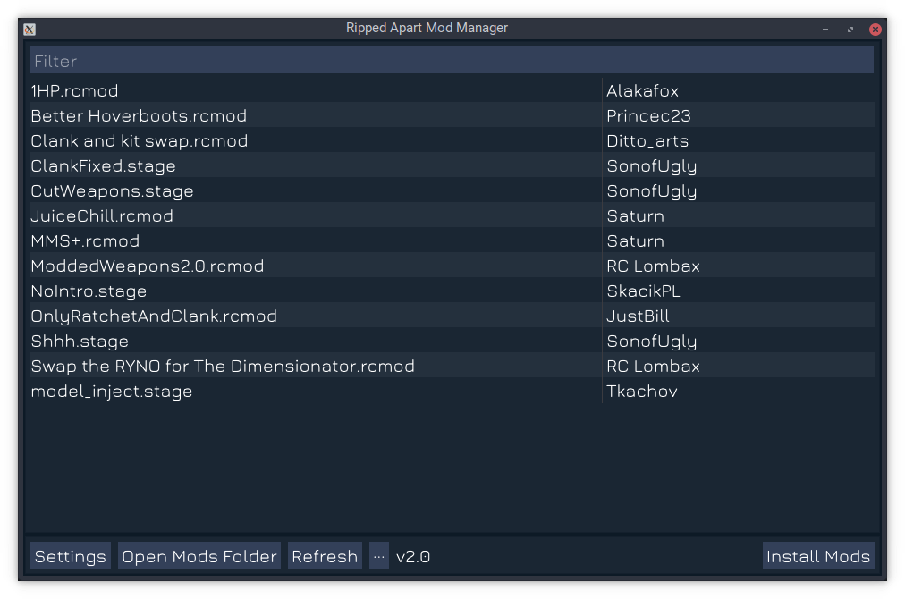

# Ripped Apart

A collection of modding tools for Ratchet & Clank: Rift Apart including a GUI mod manager and a set of command line tools for development.

- [Releases](https://github.com/chaoticgd/ripped_apart/releases)
- [Unstable Builds](https://github.com/chaoticgd/ripped_apart/releases/tag/unstable)
- [Documentation](docs/README.md)

Features currently include:
- Install mods from .rcmod and .stage files.
- Support for Windows and Linux.
- Extract the games files.
- Convert PS5 textures to .png or .exr files.
- Many miscellaneous development tools.
- Free and open source.

## Screenshot

## Building

### Linux

1.	Install the following dependencies and tools:
	- git
	- cmake
	- g++
	- xorg-dev (needed to build GLFW)
	- zenity

2.	cd into the directory above where you want Ripped Apart to live e.g. `cd ~/programs`.

2.	Download the source code and additional dependencies using Git:
	> git clone --recursive https://github.com/chaoticgd/ripped_apart

3.	cd into the newly created directory:
	> cd ripped_apart

4.	Build it with cmake:
	> cmake . -B build/ && cmake --build build/ -j 8
	
	(in the above example 8 threads are used)

### Windows

1.	Install the following tools:
	- git
	- Visual Studio (with desktop C++/cmake support)

2.	Open a Visual Studio developer command prompt.

3.	cd into the directory above where you want Ripped Apart to live e.g. `cd c:\programs`.

4.	Download the source code and dependencies using Git:
	> git clone --recursive https://github.com/chaoticgd/ripped_apart

5.	cd into the newly created directory:
	> cd ripped_apart

6.	Generate cmake files:
	> cmake . -B build/
	
	This should generate `ripped_apart.sln` along with a few `.vcxproj` files. 
	In case no such files are generated, you can explicitly specify usage of the Visual Studio generator by running the following command:
	> cmake . -G "Visual Studio X YYYY"
	
	where `X` is the Visual Studio version and `YYYY` is the Visual Studio year (example: `Visual Studio 16 2019`)
	A complete list can be obtained by running `cmake --help`.

7.	**(Option A)** Build the project from the command line:
	
	> cmake --build build/ --config BUILD_TYPE
	
	where `BUILD_TYPE` is one of `Debug` (very slow - not recommended), `Release` (no symbols - not recommended), `RelWithDebInfo` (recommended) or `MinSizeRel`.
	
	**(Option B)** Build the project from Visual Studio:

	Open the newly generated `ripped_apart.sln` in Visual Studio. In the Solution Explorer, right-click on `ripped_apart` and click `Set as Startup Project`. You should now be able to build and debug Ripped Apart using the toolbar controls and all Visual Studio features.

Executable files will be written out into the bin directory.

## Credit

A lot of the lump names were reverse engineered by [doesthisusername](https://github.com/doesthisusername). A large portion of the model format was reverse engineered by [thtrandomlurker](https://github.com/thtrandomlurker). Many bugs were pointed out by [Tkachov](https://github.com/Tkachov) who helped out by reviewing my code. Some of the swizzle tables were originally reverse engineered by Slipsy.
